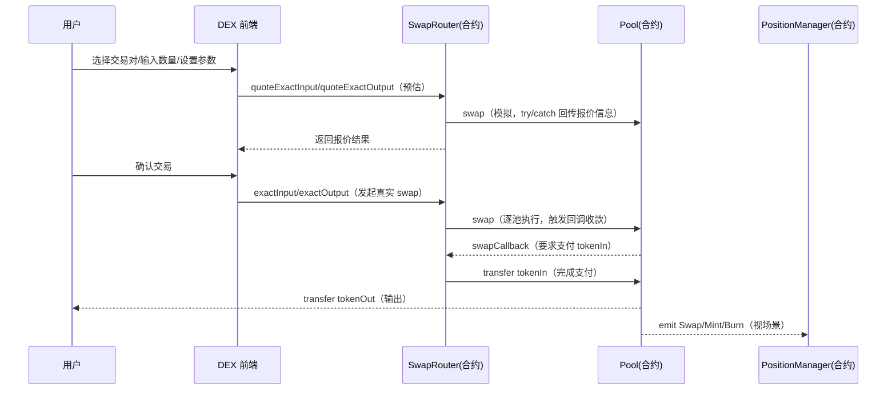
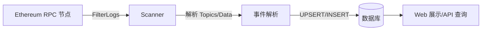
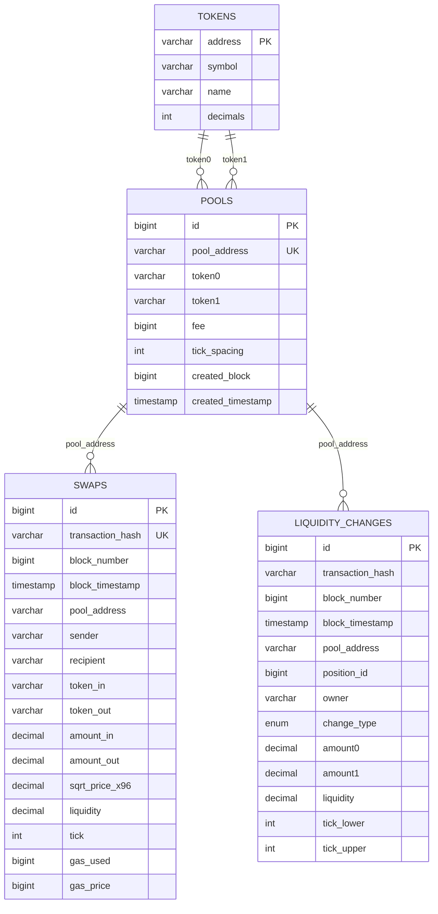
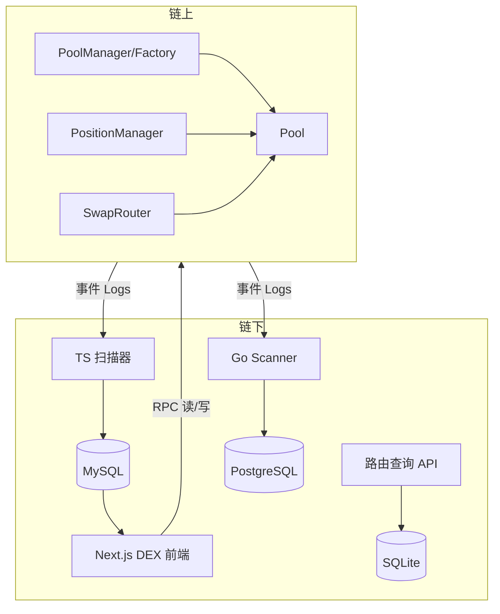
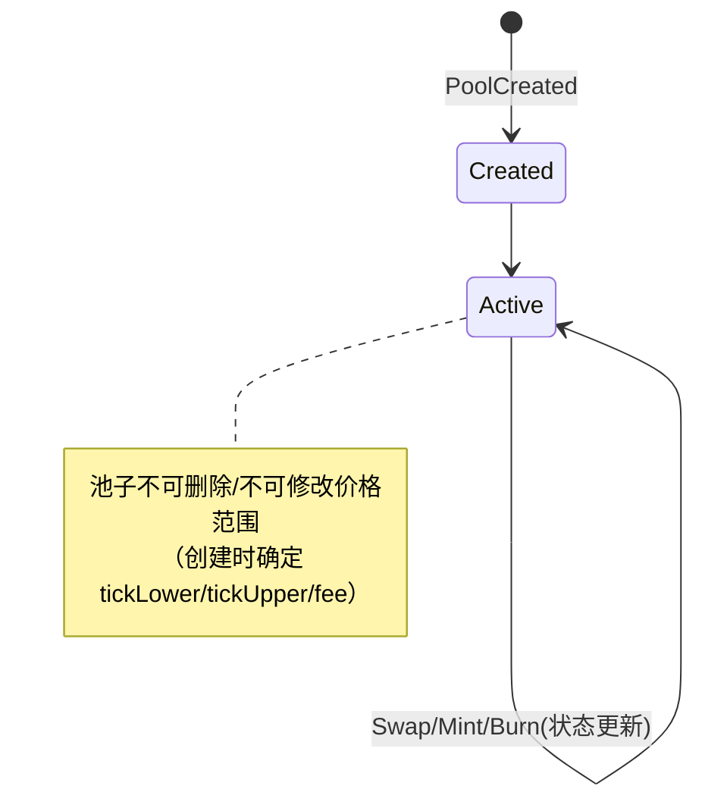
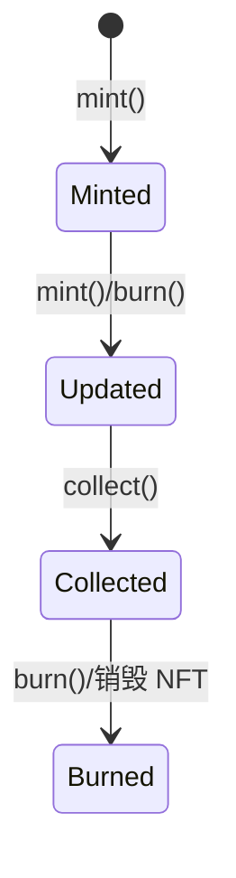
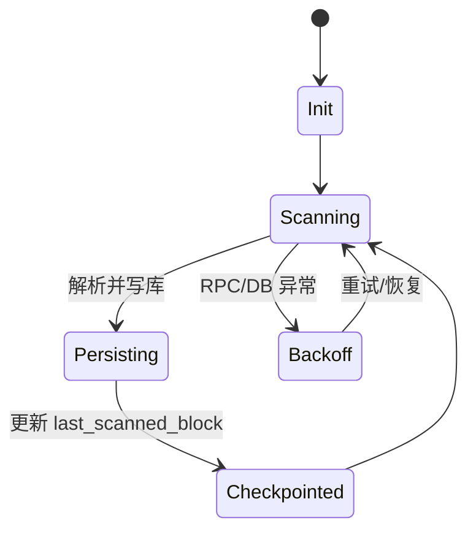

# DEX-Proj（MetaNodeSwap）技术方案

- 文档版本：v1.0
- 更新时间：2026-01-11
- 项目范围：MetaNodeSwap 合约 + DEX 前端 + 路由查询后端 + 扫链数据同步

## 摘要

本方案面向 DEX-Proj 项目，目标是交付一个类 Uniswap 的 DEX 教学/演示系统：链上侧提供 MetaNodeSwap（池子、头寸、路由）合约能力；链下侧提供两类能力：1）路由/池子数据查询 API（便于学习多跳路由与接口化能力）；2）扫链与数据落库（便于可视化展示交易、池子与流动性变动）。最终形成“链上可交互 + 链下可观测 + 前端可展示”的闭环。

## 项目背景

- 业务背景
  - 面向学习/演示：实现一个简化版集中流动性 DEX（每个池子固定价格范围），并配套页面展示 Swap / Pools / Positions。
  - 面向可观测性：通过扫链实时记录 PoolCreated、Swap、Mint、Burn、ERC721 Transfer 等事件，落库后在 Web 页面中展示统计与明细。
  - 面向可扩展：提供路由查询 API（单跳/两跳），作为后续扩展三跳、更多链/更多 DEX、缓存优化等的基础。
- 当前已知上下文
  - 合约部署网络：Sepolia
  - 合约地址：
    - PoolManager：0xddC12b3F9F7C91C79DA7433D8d212FB78d609f7B
    - PositionManager：0xbe766Bf20eFfe431829C5d5a2744865974A0B610
    - SwapRouter：0xD2c220143F5784b3bD84ae12747d97C8A36CeCB2
  - 测试代币（Sepolia）：
    - MNTokenA：0x4798388e3adE569570Df626040F07DF71135C48E
    - MNTokenB：0x5A4eA3a013D42Cfd1B1609d19f6eA998EeE06D30
    - MNTokenC：0x86B5df6FF459854ca91318274E47F4eEE245CF28
    - MNTokenD：0x7af86B1034AC4C925Ef5C3F637D1092310d83F03

## 目标

- 业务目标值
  - 用户可在前端完成代币交换信息的展示与交互闭环（Swap / Pools / Positions 基础页面齐备）。
  - 扫链数据落库后，Web 页面可展示：总交易数、池子数、独立交易者数、当日交易量/次数、交易明细、流动性变更明细。
- 技术目标值（可验收）
  - 扫链延迟：在稳定 RPC 下，最新区块落库延迟目标 ≤ 30s（可通过 scan_status 与最新区块对比）。
  - 扫链吞吐：支持按批次读取日志（batch），可配置 interval 与 batch size；支持断点续扫。
  - 路由查询：提供单跳与两跳路由查询 API；支持按最小流动性阈值过滤候选路径。
  - 可维护性：核心模块分层清晰（合约 / 扫链 / API / 前端），模块之间通过稳定接口或数据表对接。

## 非目标

- 不承诺主网部署与资产安全审计结论。
- 不实现完整 Uniswap V3 的“每个 position 自定义 tick 范围”的集中流动性模型（当前模型为“池子固定范围，position 共享范围”的简化版本）。
- 不实现三跳及以上全量路由搜索、跨链路由、MEV 防护（如私有交易、反三明治）等生产级功能。
- 不提供“完全去中心化的索引层”（如 Subgraph 全链索引）作为必选依赖；扫链与后端存储属于可替换实现。

## 名词解释

- DEX：去中心化交易所。
- AMM：自动化做市商模型。
- Pool：流动性池，维护 token0/token1 的价格与流动性状态。
- LP：流动性提供者。
- Position：LP 的头寸，在本项目中由 ERC721（PositionManager）承载。
- Tick / sqrtPriceX96：价格刻度与价格表示（Q96 定点形式）。
- Router：路由/交换入口合约（SwapRouter）。
- Scanner：扫链服务/脚本，从 RPC 拉取事件并落库。
- RPC：节点接口，通常用来查询区块、日志、合约状态。

## 总体设计

### 竞品调研

- Uniswap V3
  - 优势：集中流动性、成熟生态、工程与安全实践完善。
  - 劣势：实现复杂（tick 管理、跨 tick 交易循环）、学习曲线陡峭；纯链上读取“全量池/头寸”成本高，通常依赖索引层。
  - 本项目取舍：保留“价格范围 + sqrtPriceX96/tick”等关键概念，但简化为“每个池子固定范围”以降低实现复杂度。
- Uniswap V4（概念参考）
  - 优势：Hooks 可扩展性强。
  - 劣势：生态与工具链更复杂，不适合作为入门示例的首选实现。
- 1inch/Paraswap（聚合器）
  - 优势：多 DEX 多路径路由、价格更优。
  - 劣势：依赖链下路由与报价系统，工程体量大。
  - 本项目取舍：实现单跳/两跳的基础路由查询能力，作为扩展锚点。
- The Graph/Subgraph
  - 优势：标准化的链上数据索引与查询。
  - 劣势：部署与运维成本更高；对教学项目可能过重。
  - 本项目取舍：提供自建 Scanner（Go/TS 两种实现），强调事件解析、断点续扫、落库建模。

### 流程模型

#### 1）Swap（链上交易主流程）

#### 2）Scanner（链下事件同步流程）

### 数据模型

项目内存在多套存储实现，用于不同教学目标：

- 路由查询后端（backend）：SQLite 单表 `token_liquidity_pools`，用于池子与路由查询示例。
- 前端集成扫描器（dex-frontend）：MySQL 多表，承载交易/池子/流动性变更/扫描状态的展示与查询。
- Go 扫链服务（sync）：PostgreSQL 多表（tokens/pools/positions/swaps/ticks/events），强调更完整的索引与一致性策略。

#### MySQL（dex-frontend）ER（核心展示用）

### 设计概述

- 合约层（swap-contract）
  - PoolManager：创建与管理池子（可创建多个同交易对/费率池子）。
  - PositionManager：以 ERC721 形式管理 LP 头寸（mint/burn/collect）。
  - SwapRouter：负责报价与执行 swap，支持多池路径（indexPath）与限价（sqrtPriceLimitX96）。
  - Pool/Factory：底层池子与工厂，Pool 负责交换与事件发出。
- 前端层（dex-frontend）
  - Next.js + Tailwind 构建 Swap/Pools/Positions 页面。
  - 集成链下扫描器脚本，将链上事件落库到 MySQL，并提供 `/scanner` 页面可视化。
- 路由查询后端（backend）
  - Gin + Swagger，提供池子列表、单跳/两跳路由查询、统计查询等接口（数据源为本地 SQLite 示例库）。
- 扫链服务（sync）
  - Go 服务，基于 FilterLogs 获取相关事件并落库到 PostgreSQL；支持断点续扫与事件分发。

### 模块设计

## 详细设计

### API 设计

#### 1）路由查询后端（Gin + Swagger）

- Swagger：`GET /swagger/index.html`
- 健康检查：`GET /health`
- 池子
  - `GET /api/v1/pools?chain_id=&dex_name=&limit=20`
  - `GET /api/v1/pools/:pool_address?chain_id=`
  - `GET /api/v1/pools/token?chain_id=&token_address=`
- 路由
  - `GET /api/v1/routes/direct?chain_id=&token_in=&token_out=`
  - `GET /api/v1/routes/multi-hop?chain_id=&token_in=&token_out=&min_liquidity=10000`
- 统计
  - `GET /api/v1/stats`

约定：
- 入参地址：使用 0x 开头的 hex string。
- 返回结构：统一 `{ code, message, data }`。
- 路由查询：`direct` 返回候选池列表；`multi-hop` 返回两跳路径（包含 pools、token_path、total_fee、avg_liquidity）。

#### 2）前端集成扫描器 API（Next.js）

`GET /api/scanner?action=...`：
- `action=stats`：统计数据
- `action=swaps&page=&limit=&pool=&token_in=&token_out=&sender=`：交易列表（分页）
- `action=pools`：池子列表
- `action=liquidity&page=&limit=&pool=&owner=&type=`：流动性变更（分页）
- `action=status`：扫描状态

### 数据库设计

#### 1）backend（SQLite）

- 表：`token_liquidity_pools`
- 用途：为路由查询算法提供池子/储备/流动性/费率等数据样本；便于本地快速启动与演示。
- 关键索引：
  - `(token0_address, chain_id)`、`(token1_address, chain_id)`、`(token0_address, token1_address, chain_id)`
  - `idx_liquidity`：按链与流动性排序（active pools）

#### 2）dex-frontend（MySQL）

- swaps：交易明细（amount/price/liquidity/tick + gas）
- pools：池子信息（token pair、fee、创建块/时间）
- liquidity_changes：流动性变更（mint/burn + position_id + tick range）
- tokens：代币元信息（address/symbol/name/decimals）
- scan_status：各合约最后扫描区块

金额字段使用 `DECIMAL(78,0)`，便于容纳 uint256；展示时由前端按 decimals 格式化。

#### 3）sync（PostgreSQL）

- 目标表：tokens/pools/positions/swaps/ticks/events（更贴近索引层建模）
- 关键特性：
  - 通过 Topics 过滤多事件签名，一次 FilterLogs 拉取一批事件。
  - 支持断点续扫：从数据库恢复 last scanned block。
  - 位置管理：兼容 NFT Position 与“虚拟 position”（回退策略）。

### 核心状态机

#### 1）Pool 生命周期

#### 2）Position 生命周期（PositionManager 视角）

#### 3）Scanner 生命周期

### 性能设计

- 扫链
  - 批量查询：一次 FilterLogs 拉取区块范围内多类事件，减少 RPC 往返。
  - 可配置参数：SCAN_INTERVAL、BATCH_SIZE、START_BLOCK（便于不同环境调优）。
  - 缓存：缓存池子地址/代币信息，减少重复查询与 DB I/O。
  - 索引：swaps/pools/liquidity_changes 按 pool_address、block_number、timestamp 建索引，支撑分页与筛选查询。
- 查询/API
  - 路由查询后端通过链 ID + token pair 索引过滤候选池，再计算单跳/两跳候选。
  - 扫描器 API 使用分页参数限制单次返回量，避免大表全量扫描。

### 安全设计

- 合约交互安全（链上）
  - 回调来源校验：Router 回调中校验 msg.sender 为预期 Pool，避免伪造回调。
  - ERC20 授权：前端提示最小必要授权，避免无限授权作为默认行为（教学环境也建议给出风险提示）。
  - 价格边界：swap 通过 sqrtPriceLimitX96 做限价，避免超出价格范围的异常交易。
- 链下安全
  - 配置安全：DB 密码、RPC URL 通过环境变量/配置文件注入，禁止写入仓库。
  - API 输入校验：地址格式、分页参数、limit 上限控制；避免 SQL 注入（使用参数化查询/驱动能力）。
  - 访问控制：若暴露公网，建议增加限流、鉴权与 CORS 白名单。

### 容错容灾

- 扫链断点续传：scan_status/last scanned block 或数据库最大块号恢复，避免从 0 反复扫。
- 重试与降级
  - RPC 异常：指数退避重试；必要时切换备用 RPC。
  - DB 异常：连接池重连；写入失败时停止推进 checkpoint，保证“最多一次/至少一次”语义清晰。
- 数据备份
  - MySQL/PostgreSQL 定期备份（逻辑备份即可满足教学场景）。
  - 表增长治理：按时间窗口清理历史 swaps，或分区表（生产化可选）。

## 项目计划

| 里程碑 | 交付物 | 预计周期 |
|---|---|---|
| M1 合约能力齐备 | Pool/Position/Router 关键流程可跑通 | 1-2 周 |
| M2 前端页面 | Swap/Pools/Positions 页面与基础交互 | 1 周 |
| M3 扫链落库与展示 | 扫链脚本/服务 + Web 展示 + 查询 API | 1-2 周 |
| M4 路由查询后端 | 单跳/两跳路由 API + Swagger/Postman | 3-5 天 |
| M5 联调与压测 | 回归测试、扫描稳定性、查询性能 | 3-5 天 |

## 上线计划

- 第 1 阶段：本地/测试环境
  - 启动前端与扫描器，配置 MySQL/RPC，验证 `/scanner` 页面数据可用。
  - 启动路由查询后端，验证 Swagger 与 Postman 用例跑通。
- 第 2 阶段：测试网（Sepolia）
  - 使用固定合约地址，开启持续扫链，观测 scan_status 与数据增长趋势。
  - 监控指标：扫描延迟、错误率、DB 写入耗时、API 响应时间。
- 第 3 阶段：灰度/扩展（可选）
  - 引入缓存（Redis/内存）或队列解耦写库（教学外扩展项）。
  - 扩展三跳路由、更多代币/池子、更多链。

## 待解决问题

- 前端待实现项（按现有说明）
  - 钱包连接与合约交互逻辑补齐（wagmi/viem/rainbowkit 已引入但功能未完整接入）。
  - 实时价格获取、交易历史、流动性添加/移除等交互完善。
- 数据与架构一致性
  - backend（SQLite）与 scanner（MySQL/PG）的数据源统一策略：选择一种作为权威数据源，或明确其教学用途边界。
  - 事件驱动一致性：Mint/Burn 与 Position NFT 的关联在边界场景下的回退策略完善与验证。
- 工程化与安全
  - 合约级安全审计与测试覆盖率提升（尤其是回调、授权、边界价格与部分成交逻辑）。
  - 扫链与 API 的限流、监控告警、可观测性指标补齐。

